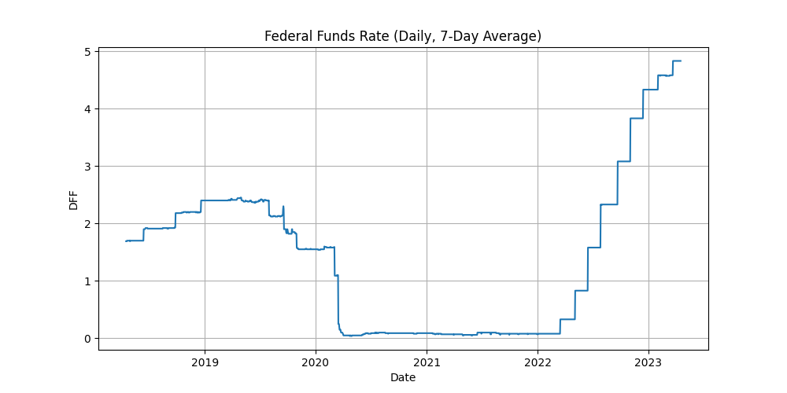

## 2023年2月1日  FOMC 会议材料 / Meeting Materials

- FOMC [会议声明](01-会议声明20230201.md)（[Statements](01-Statement20230201.md)）
- FOMC [会议记录](02-会议纪要20230201.md)（[Minutes](02-Minutes20230201.md)）
- FOMC [答记者问](03-答记者问20230201.md)（[Press Conference Transcripts](03-FOMC-press-conference20230201.md)）

## 摘要
**决议声明**

**联邦基金利率上升0.25%至4.75%**

**会议纪要**

1. 经济形势

*  劳动力数据市场紧张，失业率处于历史低位；
*  PCE继续回落，但是处于高位；
*  实际GDP增长率2.9%，主要受库存投资大幅增长和净出口的支持，实际国内私人购买年增长率仅0.2%。

2. 金融形势

* 股票指数上升，市场波动性下降，但仍高于历史分布的中值范围；
* 银行存款利率逐渐上升，滞后于联邦基金利率；
* 信贷质量稳健。

3. 参会人员预测和观点

* 与12月预测相比，实际GDP高于预测，失业低于预测；
* 最近的经济数据表明，经济增长持续低迷的可能性更高；
* 住房市场受抵押贷款利率上升影响继续疲软；
* 库存投资的强劲增长可能放缓；
* 过去三个月收到的通胀数据显示，每月的价格上涨速度有所下降，值得欢迎，但强调需要有更多的证据表明在更广泛的价格范围内取得进展，才能确信通胀已进入持续下降的轨道；
* 部分与会者赞同将联邦基金利率目标范围提高50个基点，可以更大的提高幅度，将更快地使目标范围捷径他们认为可以实现充分限制性立场的水平。

**答记者问**

*  预计未来将适当继续加息，货币紧缩的政策效果需要时间才能显现；
*  截至12月的12个月里，总个人消费支出(PCE)价格上涨了5.0%；剔除波动性较大的食品和能源类别，核心PCE价格上涨了4.4%。过去三个月收到的通胀数据显示，月度增幅有所放缓，这是令人欣喜的。然而，尽管最近的发展令人鼓舞，但美联储需要大量证据才能确信通胀正在走上持续下行的道路；
*  由于供应链修复，商品部门通货膨胀正在下降，在其他部门，比如住房部门以及核心非住房服务部门，我们预计通胀还会继续上升一段时间，但随后会下降；
*  鲍威尔认为通货紧缩过程已经开始，通胀预期是产生通胀的非常重要的一部分，人们相信通胀会降低，是降低通胀的一部分。

**FOMC提到的数据指标**
